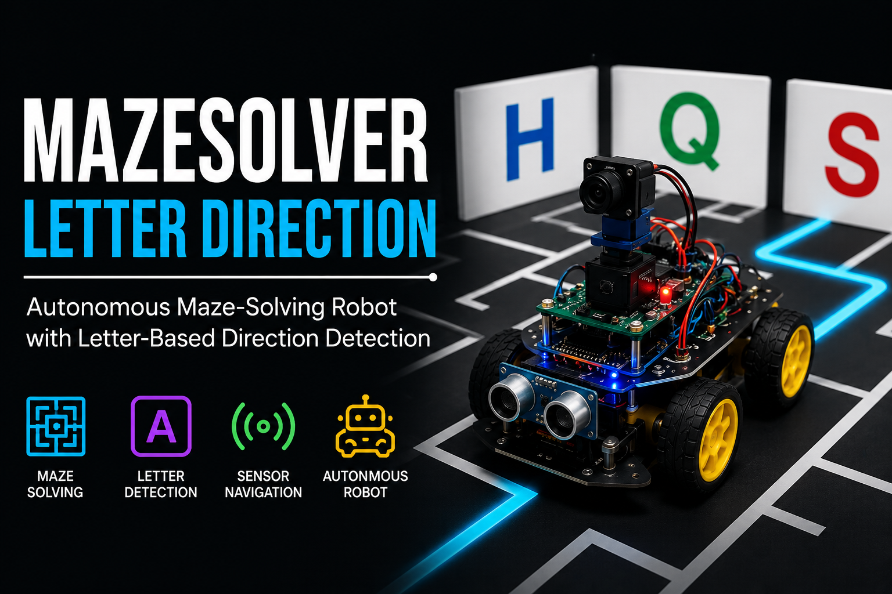

# MazeSolver --- Letter Direction 🤖

> An autonomous maze-solving robot that uses a Raspberry Pi for
> vision-based letter detection and an Arduino Mega for robot control.

[](https://www.python.org/)
[](https://www.raspberrypi.com/)
[](https://www.arduino.cc/)
[](https://github.com/ultralytics/ultralytics)



## 🚀 What is MazeSolver?

MazeSolver is a robotics project designed for autonomous maze
navigation. A camera mounted on the robot captures the maze environment,
while a YOLO model identifies letter-based markers.

When a target/marker is detected, the Raspberry Pi:

1.  Captures a camera frame.
2.  Runs the trained YOLO model.
3.  Extracts the detected letter.
4.  Sends the result to an Arduino Mega over serial.
5.  Stops the robot when required.
6.  Activates a servo-based mechanism to drop a kit.
7.  Sends a `GO` command to resume movement.

The current repository is a **work-in-progress prototype** and the
hardware-side motor/sensor firmware is not included yet.

## 🧠 System Architecture

``` text
                 ┌──────────────────────┐
                 │   Raspberry Pi       │
                 │                      │
 Camera ────────►│ Picamera2            │
                 │ YOLO Letter Detector │
                 │ Python Control       │
                 └──────────┬───────────┘
                            │
                     UART / Serial
                     115200 baud
                            │
                            ▼
                 ┌──────────────────────┐
                 │    Arduino Mega      │
                 │                      │
                 │ Robot Control        │
                 │ Motor/Sensor Logic   │
                 └──────────────────────┘
                            │
                       Robot hardware
```

## ✨ Features

-   📷 Raspberry Pi Camera integration using `Picamera2`
-   🧠 YOLO-based letter detection
-   🔌 Serial communication with Arduino Mega
-   🦾 Servo-controlled kit dropping mechanism
-   ⚙️ Configurable camera resolution, FPS and detection confidence
-   🧩 Modular Python files for camera, detection, serial and servo
    control

## 🔌 Wiring

### Current Raspberry Pi-side wiring


  Device                 Connection
  ---------------------- ------------------------
  Camera Module          Raspberry Pi CSI
  Arduino Mega           Serial/UART connection
  Servo signal           Raspberry Pi GPIO 18
  Serial baud rate       115200
  Camera resolution      640 × 480
  Camera FPS             30
  Detection confidence   0.70

> **Important:** The exact Arduino Mega motor-driver, motor and sensor
> wiring is not defined in the current repository, so it is
> intentionally not guessed here.

## 📁 Project Structure

``` text
MazeSolver-LetterDirection/
├── main.py          # Main control loop
├── camera.py        # Raspberry Pi camera interface
├── config.py        # Project configuration
├── serialMega.py    # Serial communication with Arduino Mega
├── servo.py         # Servo / kit-drop control
├── victim.py        # YOLO-based detection
├── model/
│   └── best.pt      # Trained YOLO model
└── README.md
```

## 🔄 Control Flow

``` text
Start
  │
  ▼
Capture camera frame
  │
  ▼
Run YOLO detection
  │
  ├── No detection ──► Continue moving
  │
  └── Detection
         │
         ▼
      Stop robot
         │
         ▼
   Read detected letter
         │
         ▼
   Send letter to Mega
         │
         ▼
     Drop kit
         │
         ▼
      Send GO
         │
         ▼
    Continue maze
```

## 🛠️ Software

-   Python 3
-   Picamera2
-   Ultralytics YOLO
-   GPIO Zero
-   PySerial

## ⚙️ Configuration

The main settings are stored in `config.py`:

``` python
CAMERA_WIDTH = 640
CAMERA_HEIGHT = 480
FPS = 30

MEGA_PORT = "/dev/ttyAMA0"
BAUDRATE = 115200

SERVO_PIN = 18
DROP_TIME = 0.7

CONFIDENCE = 0.70
```

## ▶️ Running

Install the required Python packages for your Raspberry Pi environment,
place the trained model at:

``` text
model/best.pt
```

Then run:

``` bash
python3 main.py
```

## 📡 Serial Commands

The Raspberry Pi currently sends:

  Command      Purpose
  ------------ --------------------------
  `STOP`       Stop the robot
  `GO`         Resume movement
  `<LETTER>`   Send the detected letter

## 🧪 Project Status

**Status: 🚧 Active Development**

The vision/control prototype is being developed first. The next stage is
integrating the complete Arduino Mega firmware, motor driver, sensors
and maze-solving logic.

## 🔮 Roadmap

-   [ ] Complete Arduino Mega firmware
-   [ ] Integrate motor driver and navigation sensors
-   [ ] Improve letter-detection accuracy
-   [ ] Add false-detection filtering
-   [ ] Add maze state/path tracking
-   [ ] Add telemetry/debug logging
-   [ ] Add demonstration video
-   [ ] Add final robot photos

## 👨‍💻 Author

**Rishi Pratap Singh**

Built as a robotics and autonomous-navigation project.

------------------------------------------------------------------------

⭐ If this project helps you, consider starring the repository.
